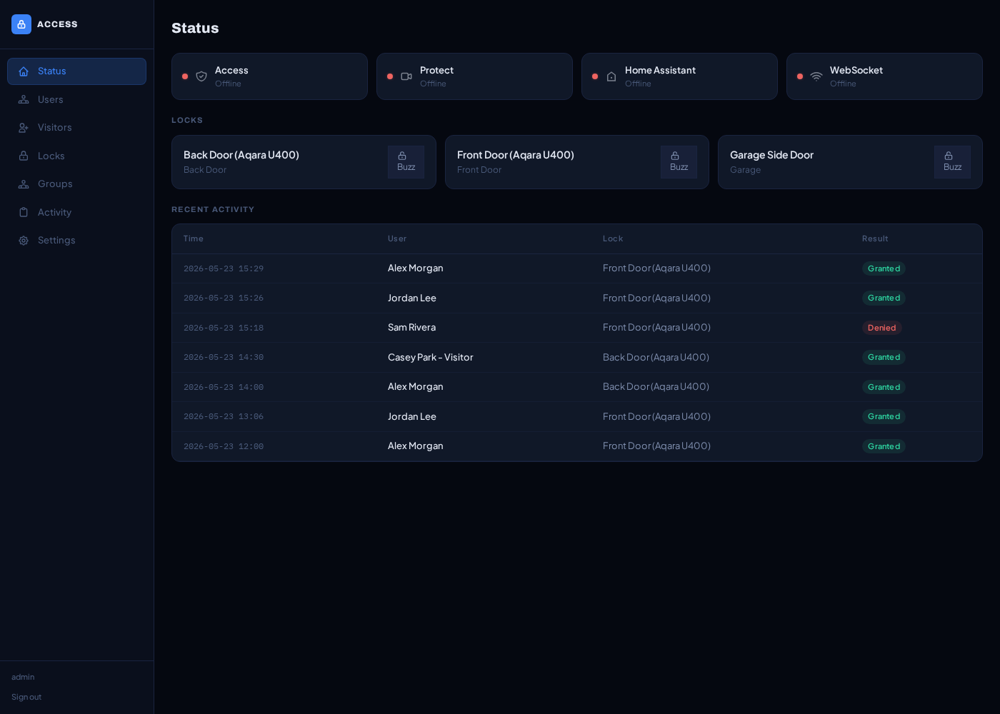

<div align="center">

# Access Control

**Coordinate UniFi Access + Protect events with Home Assistant locks and alarm panels.**

[](https://github.com/nstefanelli/hassio-access-control/releases)
[](https://github.com/nstefanelli/hassio-access-control/actions/workflows/ci.yaml)
[](LICENSE)
[](access_control/build.yaml)

[Install](#install) · [Configure](docs/CONFIGURATION.md) · [Operate](docs/OPERATIONS.md) · [API](docs/API.md) · [Security](docs/SECURITY-MODEL.md)

</div>



Access Control is a Home Assistant **app** (formerly “add-on”). It listens for
credential events from UniFi Access and Protect, evaluates the user’s groups,
schedules, alarm restrictions, and individual rules, then operates the mapped
UniFi door or Home Assistant `lock.*` entity.

The dashboard runs in HA Ingress and is restricted to HA administrators. The
standard installation has no host port and needs no second dashboard password
or long-lived HA token.

## Highlights

- **Unified credential policy:** face, NFC, PIN, fingerprint, and supported
  UniFi remote events flow through one authorization engine.
- **Native and HA locks:** operate UniFi-native doors or map any controllable HA
  `lock.*` entity to an Access reader/location or Protect doorbell.
- **Groups and schedules:** grant all locks or selected locks, with days-only,
  time-only, combined, and overnight windows in HA’s configured timezone.
- **Alarm-aware access:** block by armed-home/armed-away state or let an
  eligible group disarm configured `alarm_control_panel.*` entities after a
  successful grant.
- **Lockdown:** persistently deny authorization-engine grants through a shared
  physical-command barrier, including a final check before each unlock;
  persistence reads and unresolved hub enforcement fail closed and are
  observable through authenticated health.
- **Durable re-locks:** write the timed HA re-lock intent before unlocking,
  survive restart, retry after HA recovery, and clear only after HA reports the
  entity actually `locked`.
- **Optional bidirectional door sync:** reconcile an HA lock with its paired
  Access door in either direction, including native unlock-schedule changes,
  authenticated rule/state readback, event-driven wakeups, polling for drift,
  locked-wins conflict handling, restart recovery, and lockdown override.
- **Visitors:** create and extend time-windowed UniFi visitors using the HA site
  timezone, with strict DST validation and optional encrypted PIN storage.
- **Split consoles:** keep Access on one UniFi console and Protect on another;
  the persisted Access site namespace prevents a replacement site from
  inheriting grants that use the same upstream IDs.
- **Audit and diagnostics:** searchable activity, 90-day retention, connection
  health, circuit-breaker state, reconnect signals, and a scoped Bearer API.
- **Self-contained UI:** compiled CSS and browser JavaScript ship in the image;
  the dashboard does not require runtime CDN access.

## Requirements

| Requirement | Notes |
|---|---|
| Home Assistant OS or Supervised | Supervisor, app store, Ingress, and auth support are required. HA Container is not a supported app host. |
| UniFi Access | A console with an Access deployment and a dedicated local account able to perform the enabled workflows. An official local API token with `view:space` and `edit:space` is strongly recommended for schedule-aware commands and authoritative readback. |
| UniFi Protect | Optional for Access-only use; required for G6 Entry/Protect doorbell events. It may run on a separate console. |
| HA administrator | The dashboard is admin-only. |
| HA lock/alarm entities | Required only for the HA-external lock and alarm features you configure. UniFi-native doors can be used directly. |

UniFi role names and capabilities vary across console/application releases.
Use dedicated local account(s) and the narrowest permissions that work. The
setup login test cannot prove every later visitor, user, door, and Protect
operation; Super Admin is a broad fallback, not a least-privilege default.

## Install

1. In Home Assistant, open **Settings → Apps → App store → ⋮ → Repositories**.
2. Add:

   ```text
   https://github.com/nstefanelli/hassio-access-control
   ```

3. Install and start **Access Control**.
4. Open the sidebar item as an HA administrator.
5. Complete first-run setup with the primary UNVR/Protect console and, when
   different, the optional Access console. Create an Access API token under
   **Access → Settings → General → Advanced → API Token** with `view:space` and
   `edit:space`, then enter it in setup or later under Settings. With the default
   `use_supervisor_api: true`, HA connection details are supplied
   automatically.
6. Add/map locks, then create groups and verify schedules before testing a
   physical grant.

See [Configuration](docs/CONFIGURATION.md) for the complete setup sequence,
remote HA mode, fixed secret-key modes, entry-device mappings, alarm semantics,
visitor timezone handling, and split Access/Protect consoles.

## App options

| Option | Default | Meaning |
|---|---:|---|
| `log_level` | `info` | App/uvicorn verbosity: `trace`, `debug`, `info`, `notice`, `warning`, `error`, or `fatal`. |
| `use_supervisor_api` | `true` | Use `http://supervisor/core` and Supervisor’s rotating token as the HA credential pair. Disable only for a different HA instance. |

Everything else is configured in the dashboard and persisted in
`/data/access_control.db`.

Use Home Assistant’s app page for an ordinary manual restart. The packaged
scheduled-restart control is available through Supervisor; direct-host mode
requires an explicit trusted `RESTART_COMMAND`. See
[Operations](docs/OPERATIONS.md#restart-behavior).

## Policy behavior worth knowing

- An active group is a positive grant for all or selected locks. An individual
  rule is a fallback grant; it does not revoke a grant from a group.
- Alarm blocking considers all group memberships. A schedule-active
  `can_disarm` group can override only when it is not itself blocked for the
  current alarm state.
- Unknown, unavailable, mixed, pending, triggered, night-armed, and other
  transitional alarm states are handled conservatively when armed-state block
  flags apply.
- An enabled schedule with no restriction or only one time bound is rejected
  and fails closed. Overnight after-midnight time belongs to the preceding
  selected day.
- Visitor and schedule wall times follow Home Assistant’s configured IANA
  timezone. Nonexistent and ambiguous daylight-saving times are rejected.
- For a native Access door, **Unlock** applies `keep_unlock`, **Lock** uses
  `lock_now` so an active schedule or temporary unlock is ended immediately,
  and **Follow Schedule** sends `reset` to return control to Access. Follow
  Schedule may therefore unlock the door immediately when its native schedule
  is active; `reset` is deliberately not used as a generic lock command.
- The current visitor UI does not reveal a submitted PIN later. Keep the value
  through an appropriate secure channel if the visitor needs it.

These details are expanded in [Configuration](docs/CONFIGURATION.md).

## How it works

```text
Access WebSocket ─┐
                  ├─> deduplicate + bound concurrency ─> authorization engine
Protect WebSocket ┘                                      │
                                                         ├─> UniFi door
HA Ingress ───────> admin dashboard ─────────────────────┤
Bearer API ───────> health/reporting/lockdown ───────────┤
                                                         └─> HA lock/alarm
                                                                  │
                                                                  v
                                                        durable SQLite state
```

Access and Protect may report the same physical credential event. The dispatcher
deduplicates the cross-path reports before the authorization engine runs. A
grant is logged per lock, generates `access_control_granted` in HA, and may arm
a durable re-lock. A denial logs its reason without issuing an unlock.

For a timed HA unlock, the new re-lock row is committed before the physical
unlock. A failure or timeout is treated as ambiguous: the earliest applicable
re-lock intent is retained because HA may have executed the request before its
response was lost. A shared command barrier orders
unlock, re-lock, hub-sync, client-swap, and lockdown work so enabling lockdown
cannot be overtaken by an older application command.

The Access namespace is enrolled during first setup and verified before every
authenticated Access session is published. Changes to the Access host/target,
including switching single/split mode, are accepted only when the replacement
exposes the same site identity; moving to a different Access site requires a
new initialization so site-scoped user and door IDs cannot inherit old grants.
This namespace check is independent of TLS peer verification and does not make
an unverified UniFi certificate trusted.

With an official Access API token, door commands use the local HTTPS API on
port `12445`, require a strict success envelope, and are followed by bounded
rule and relay-state reads. The token is encrypted in SQLite and can instead
be supplied at runtime with `ACCESS_CONTROL_ACCESS_API_TOKEN`; a configured but
invalid token fails the command and never silently falls back to the private
session API. Without a token, compatibility mode retains the existing private
console path, but firmware-dependent readback—especially after `reset`—cannot
provide the same schedule/physical-state assurance.

Hub hold-open ownership is written before `keep_unlock` and cleared only after
a confirmed safe transition. Startup and shutdown recovery therefore lock a
possibly held-open hub after a crash instead of trusting process-local state.
For opted-in pairs, Access rule events trigger an immediate authenticated
reconcile and the five-second poll catches missed events or external drift.
HA-only changes flow to Access; Access-only changes, including verified native
schedule activation/deactivation, flow to HA. Unreadable state, simultaneous
opposing changes, and unbaselined disagreement resolve locked, except that a
verified active Access schedule may establish the initial unlocked state.

Background supervisors recover Access/Protect sessions, refresh topology,
monitor HA through a circuit breaker, retry pending re-locks, synchronize active
visitors, and maintain heartbeat-backed WebSocket reconnect loops. Topology
refresh is atomic and skips unchanged rows to reduce idle SQLite writes. Native
doors absent from a valid non-empty refresh are retired from normal operation
without deleting their history and revive if they reappear. Related multi-field
configuration changes also commit as one serialized bundle.

See [Architecture](docs/ARCHITECTURE.md) for component and transaction details.

## Security summary

- HA administrators, Supervisor/Core, configured HA, and configured UniFi
  consoles are trusted.
- Ingress headers are not a cryptographic defense against another compromised
  app on the same Supervisor network.
- Dashboard mutations require CSRF; API endpoints require hashed, scoped Bearer
  keys and authentication failures are rate limited.
- Credentials, the optional Access API token, and optional PINs are encrypted
  with Fernet using a PBKDF2-
  derived key. In default database-key mode, a complete database copy can also
  recover the key. Advanced environment-key mode must be selected at first
  setup and requires the exact external key forever.
- UniFi TLS certificate verification is disabled for the common self-signed
  console deployment. Keep HA-to-UniFi traffic on a trusted network.
- Backups and WAL files are sensitive. Never copy only a live SQLite main file.

Read the full [Security model](docs/SECURITY-MODEL.md), safe
[backup/recovery runbook](docs/OPERATIONS.md#backup), and private-reporting
[Security Policy](SECURITY.md) before exposing or hardening the deployment.

## REST API

The external API supports health, logs, confirmed lock/unlock/follow-schedule
control, local authorization schedules, users, diagnostics, and a full-scope,
idempotent lockdown setter. It intentionally does not expose momentary buzz.
Keys use one of three scopes: `full`, `read_only`, or `locks_only`; lock-only
keys cannot inherit alarm auto-disarm.

The supplied manifest does not publish an API port, so callers need an internal
route or deliberate authenticated proxy. See the exact [REST API
contract](docs/API.md) before building an automation. Lockdown requests must
include the explicit desired query value, for example
`POST /api/lockdown?enabled=true`; duplicate delivery cannot toggle it off.

## Documentation

| Guide | Use it for |
|---|---|
| [Documentation index](docs/README.md) | Canonical guide map and source-of-truth order |
| [Configuration](docs/CONFIGURATION.md) | Install, first run, credentials, policies, mappings, schedules, and visitors |
| [Operations](docs/OPERATIONS.md) | Monitoring, logs, restart, update, backup/restore, and troubleshooting |
| [REST API](docs/API.md) | Endpoint fields, scopes, errors, and examples |
| [Architecture](docs/ARCHITECTURE.md) | Runtime components, data flow, persistence, and resilience |
| [Security model](docs/SECURITY-MODEL.md) | Threat boundaries, accepted risks, keys, storage, and hardening |
| [Development](docs/DEVELOPMENT.md) | Tests, frontend build, local container, CI, and release flow |
| [Changelog](access_control/CHANGELOG.md) | Release-by-release behavior and migration notes |

Dated audit and specification files are historical records, not current
operator instructions.

## Project scope

Access Control coordinates existing systems; it is not:

- a replacement for UniFi Access hardware/controller enforcement;
- a Home Assistant custom integration that creates HA entities;
- a certified life-safety, fire-egress, or alarm system;
- a security boundary against HA admins, host root, or a compromised UniFi
  console;
- a guarantee of availability when Supervisor, HA, the LAN, or UniFi is down.

Installers remain responsible for code-compliant egress, fail-safe/fail-secure
hardware choices, and local emergency procedures.

## Contributing and license

See [CONTRIBUTING.md](CONTRIBUTING.md) and the contributor
[development guide](docs/DEVELOPMENT.md). Security issues must use the private
channel in [SECURITY.md](SECURITY.md), not a public issue.

Licensed under the [MIT License](LICENSE).
