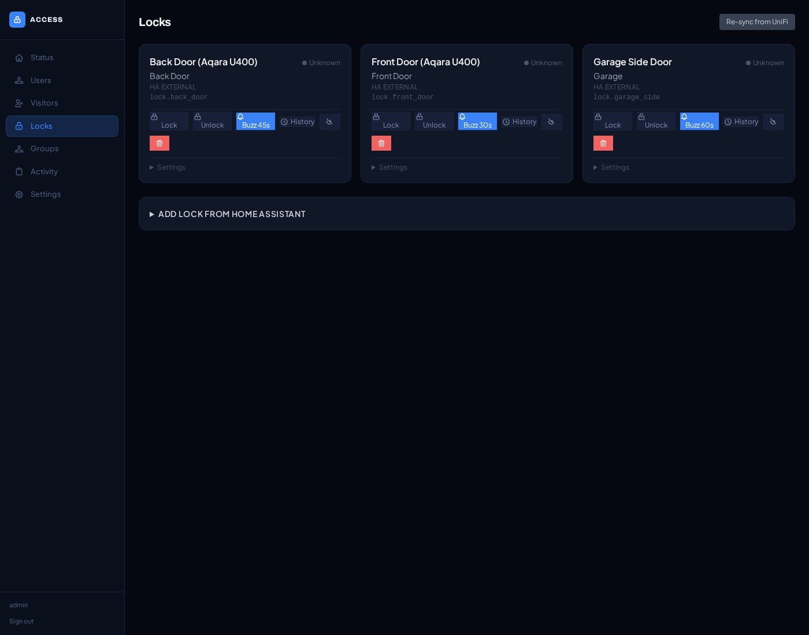
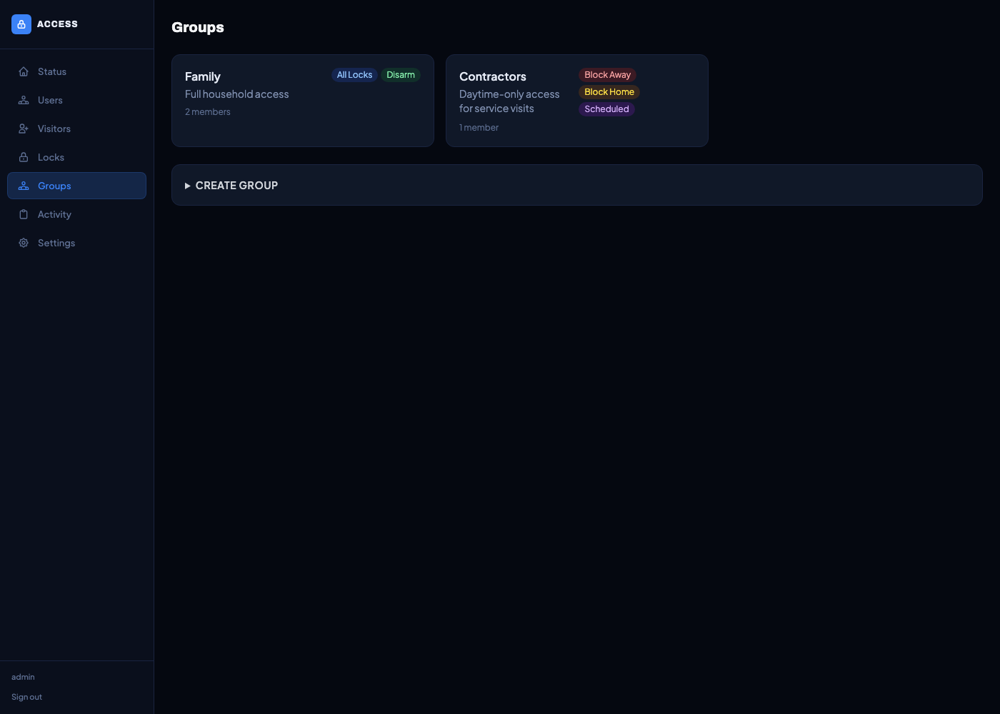
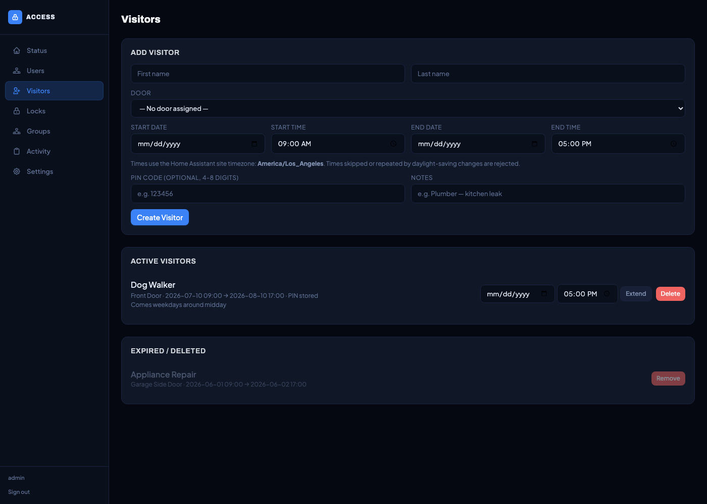
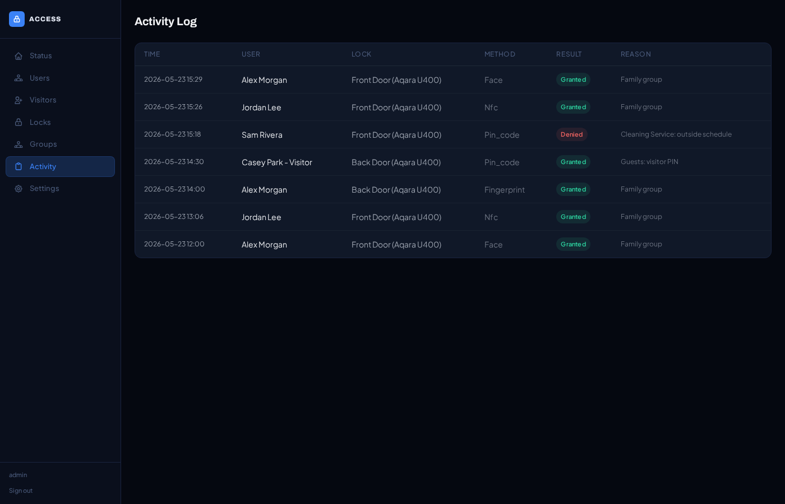
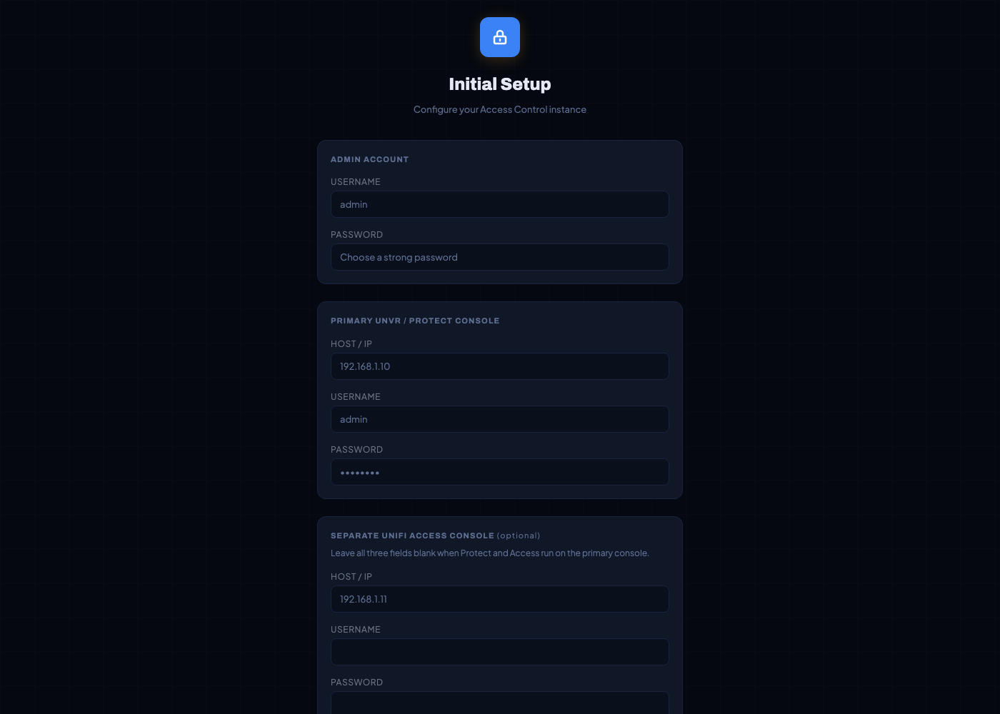
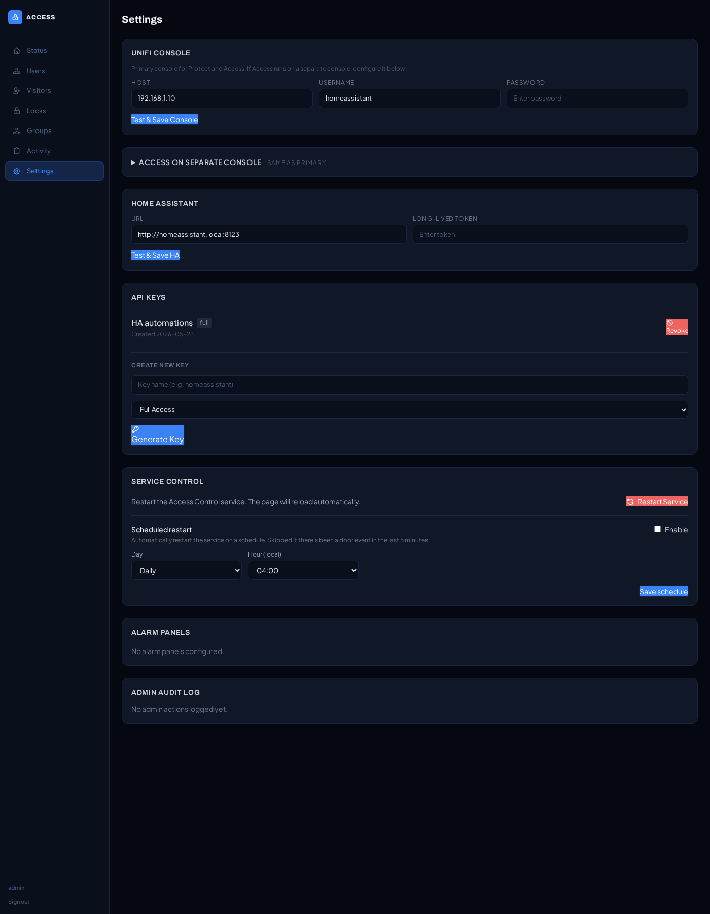
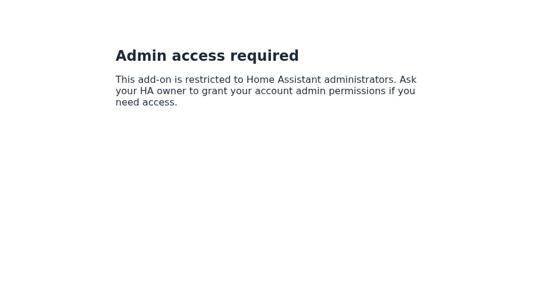
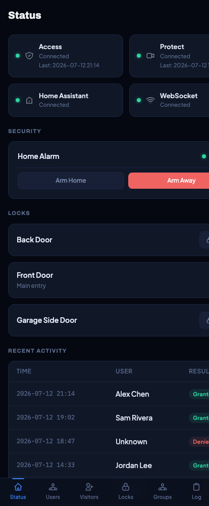
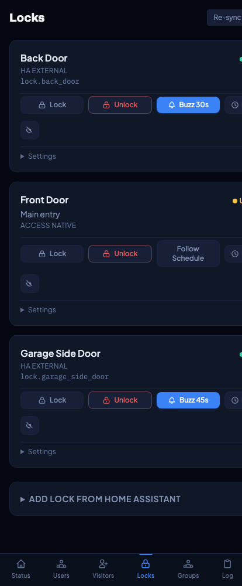

<div align="center">

# Access Control

**Bridge UniFi Access + Protect with Home Assistant for unified door, lock, and alarm control.**

[](https://github.com/nstefanelli/hassio-access-control/releases)
[](LICENSE)
[](access_control/build.yaml)
[](access_control/build.yaml)
[](https://github.com/nstefanelli/hassio-access-control/actions/workflows/ci.yaml)

[Install](#install) · [Use cases](#what-it-does) · [Configuration](#configuration) · [Architecture](#how-it-works) · [Security](#security)

</div>

---


Access Control is a Home Assistant **app** *(formerly called "add-on")* that
turns your UniFi Access + Protect deployment and any Home Assistant lock or
alarm panel into a single coordinated system. When someone taps an NFC card,
shows their face to a G6 Entry Pro, or types a PIN, this app decides who
gets in based on the groups, schedules, and alarm state you configure — and
then drives the right HA `lock.*` and `alarm_control_panel.*` entities.

The dashboard lives in your HA sidebar (admin-only, via HA SSO), so there's
no second password to remember and no second URL to bookmark.

## What it does

### 🏠 Family access that just works



Authorize everyone in the household for every door. If the alarm is armed
when someone gets home, it auto-disarms on a successful authentication.
Unlock + auto-relock after 30 seconds — every door, configurable per lock.

### 🧹 Scheduled access for contractors and cleaners



Your cleaner gets in **only on Tuesdays from 10 am to 2 pm**, and *only*
if the alarm isn't armed-away. Out of schedule? Access denied. The dog
walker can have a separate window. The contractor can be one-time-only.
No more handing out fobs or sharing PINs you'll forget to rotate.

### 👋 One-tap visitor PINs



Need to let in a plumber while you're at work? Create a visitor with a
time window. UniFi enforces the start/end times natively; the PIN expires
automatically. The app keeps the PIN encrypted-at-rest so you can look it
up later without re-issuing.

### 🔐 Multi-factor: face + PIN + NFC + fingerprint

All four credential types from the G6 Entry Pro are routed through the same
authorization pipeline. Use whatever the household member prefers and the
authorization is identical.

### 📋 Activity log + audit trail



Every grant and every denial is logged with timestamp, user, lock, method,
and reason. 90-day retention by default. Filter per-lock from the Locks
page to answer "who came through the back door at 3 am?" in one click.

### 🚨 Alarm-aware decisions

A "Block when armed away" flag on a group denies access (with logging) if
the alarm is set. A "Can disarm" flag does the opposite — auto-disarms on
a successful grant. Combine both: family disarms on entry; the cleaner is
blocked entirely if anyone forgot to disarm.

### 🔌 HA-native via the Supervisor proxy

The app speaks to HA through Supervisor's authenticated proxy
(`http://supervisor/core`). No long-lived token to manage. Locks, alarm
panels, and any entity exposed to HA are usable here.

### 🛡️ Resilient by design

WebSocket clients reconnect with jittered backoff after UNVR restarts.
Pending re-locks survive app restarts (persisted to SQLite; re-armed on
startup). HA reachability is wrapped in a circuit breaker so a brief HA
outage doesn't turn into a flood of failed requests. A scheduled-reboot
timer cycles the app weekly if you want it, skipping the reboot if there's
been a door event in the last 5 minutes.

## Requirements

| Requirement | Notes |
|---|---|
| **Home Assistant with Supervisor** | HAOS (Home Assistant Operating System) or Home Assistant Supervised on Debian. **HA Container is not supported** — it doesn't run Supervisor, so the app's API proxy and ingress routing don't exist. |
| **UniFi Console** | A UDM / UDM-Pro / UDM-SE / UCG / UNVR running both **UniFi Access** and **UniFi Protect** applications. Split-console (Access on one, Protect on another) is also supported. |
| **HA admin role** | The dashboard is admin-only via HA's SSO. Non-admin HA users get a 403. Promote household members to admin in HA's user settings if you want them to see the dashboard. |
| **At least one HA lock or alarm entity** | Any `lock.*` entity HA can control (Aqara via Zigbee, Z-Wave, August, etc.) and optionally an `alarm_control_panel.*`. |
| **G6 Entry Pro or other UniFi reader** *(recommended, not required)* | The app works with any UniFi Access setup but is most valuable with the G6's multi-credential events (face, NFC, PIN, fingerprint). |

## Install

### Add this repository to your HA app store

In Home Assistant: **Settings → Apps → ⋮ → Repositories**, paste:

```text
https://github.com/nstefanelli/hassio-access-control
```

Then install **Access Control** from the app store and start it. The
sidebar entry appears for HA admin users immediately.

### Manual install

Useful if you want to track a feature branch or if you're installing
from a private fork.

```bash
# On HAOS via the Advanced SSH & Web Terminal app (Protection Mode off)
cd /addons
git clone https://github.com/nstefanelli/hassio-access-control.git
```

Then in HA: **Settings → Apps → App Store → ⋮ → Reload**. The app appears
under **Local apps**.

### First-run setup

1. Click **Access Control** in the HA sidebar (must be HA admin).
2. Step through the on-screen wizard:

   

   - **UniFi Console host** + a local service account with **Super Admin**
     on both Access and Protect.
   - HA URL + long-lived token — *leave blank by default*; the app uses
     the Supervisor proxy automatically. Only fill in if you're pointing
     this app at a different HA instance.
   - Optional split-console: Access and Protect on different UniFi
     consoles.

3. On the **Locks** page, wire each HA lock entity to the matching UniFi
   reader (location ID or doorbell camera).
4. On the **Groups** page, create the access tiers (Family, Cleaner,
   Guests, etc.) and add members.

## Configuration

### App options

The app exposes only two settings in Supervisor. Everything else — UniFi
credentials, locks, groups, schedules, visitors — is configured through
the in-app dashboard and stored encrypted at rest in `/data`.

| Option | Default | What it does |
|---|---|---|
| `log_level` | `info` | Log verbosity. `trace`, `debug`, `info`, `notice`, `warning`, `error`, `fatal`. Drop to `debug` if you're chasing an authorization edge case. |
| `use_supervisor_api` | `true` | Talk to HA through Supervisor's authenticated proxy. Turn off only if you want this app to talk to a different HA instance — you'll then enter URL + long-lived token in the in-app Settings page. |

The web UI binds to container port `8080` and is reached through HA
Ingress only — no direct host port is exposed. If you ever need to point
HA at a non-standard host port for the app, change it in **Network**
under the app's Supervisor page; the in-app `<base href>` and watchdog
URL track the change automatically.

### In-app settings reference



#### Service control

- **Scheduled reboot** — choose a day-of-week (or daily) and an hour. The
  app restarts itself at that time, *unless* a door event arrived in the
  last 5 minutes (avoids kicking someone mid-tap). Useful for clearing
  long-lived WebSocket sessions on a fixed cadence. Persisted; manual
  restarts within the same hour don't double-fire.
- **Restart now** — manual button. Issues a SIGTERM to uvicorn; the
  Supervisor watchdog restarts the container.

#### UniFi credentials

- **UNVR host** — the UniFi Console's hostname or IP. Both Access and
  Protect endpoints are derived from this, unless you split the consoles
  (next section).
- **Service account** — username + password. Encrypted with Fernet
  (PBKDF2-SHA256 key derivation, 480 000 iterations) before being written
  to `/data/access_control.db`.

#### Split-console (advanced)

If your Access deployment lives on a different UniFi console than your
Protect cameras (e.g., a UDM-Pro running Protect plus a separate dream
machine running Access), enter the second console's host + credentials
here. The app keeps separate WebSocket sessions to each.

#### Home Assistant

- **URL** — leave blank to use the Supervisor proxy. Fill in only if
  you're pointing this app at a remote HA instance.
- **Long-lived token** — required only when URL is filled in. The token
  needs read+write to `lock.*` and `alarm_control_panel.*`.

#### API keys

Three scopes:

- `full` — every `/api/*` endpoint, including admin actions
- `read_only` — GET only; useful for HA REST sensors mirroring app state
- `locks_only` — lock/unlock + health; useful for an automation that
  needs to drive doors but shouldn't see user data

Keys are SHA-256 hashed at rest. The raw value is shown **once** at
creation; you can't retrieve it later.

#### Alarm panels

Wire HA `alarm_control_panel.*` entities for the "Can disarm" and
"Blocked when armed" group behaviors. Per-panel:
- HA entity ID (validated against `^alarm_control_panel\.[a-z0-9_]+$`)
- PIN code used to disarm (4–8 digits, validated and encrypted)

### Lock settings

For each lock (HA lock or UniFi native):

| Setting | What it does |
|---|---|
| **Buzz** | Manual UI button always does a timed unlock + auto-relock. |
| **Buzz duration** | Seconds the lock stays unlocked when buzzed (default 5). |
| **Remote relock** | Auto-relock after an unlock issued via the UniFi mobile app. |
| **Device-auth relock** | Auto-relock after a successful face / PIN / NFC / fingerprint authentication at this door. |
| **Relock duration** | Seconds before auto-relock fires (default 30). One timer per lock, shared across all three relock triggers. |
| **Hidden** | Hides the lock from the main list without deleting it (useful for the un-wired Hub Door Mini "ghost" devices). |

### Groups & schedules

| Per-group field | What it does |
|---|---|
| **All locks** vs **specific locks** | "All locks" grants every door; specific locks pick a subset. |
| **Can disarm** | On a successful unlock, also disarm the alarm if it's armed. |
| **Blocked when armed-away** | Deny access (with a log entry) if the alarm is armed-away. |
| **Blocked when armed-home** | Same as above but for armed-home. |
| **Schedule** | Days of the week + start/end time. Outside the window, access is denied. |

Group rules **layer**: a user in multiple groups gets access if *any*
active group grants it. The "blocked" flag is overridden only by a
"can-disarm" flag from a *different*, non-blocking group — so the
"cleaner blocked when armed" + "family can disarm" combo is safe even if
a family member is somehow also in the cleaning group.

### Individual rules

Per-user, per-lock overrides for the one-offs that don't fit a group. A
rule can have its own schedule. Useful for "the kids can use the back
door only after school" or "the contractor can use only the garage door".

## How it works

```text
                ┌─────────────────────────────────────────────────────────┐
                │                  UniFi Console (UDM / UNVR)              │
                │  ┌───────────────────┐         ┌─────────────────────┐  │
                │  │  Access REST + WS │         │  Protect WebSocket  │  │
                │  │  access.logs.add  │         │  doorAccess / ring  │  │
                │  └─────────┬─────────┘         └──────────┬──────────┘  │
                └────────────┼────────────────────────────────┼───────────┘
                             │                                │
                             ▼                                ▼
                ┌─────────────────────────────────────────────────────────┐
                │            Access Control app  (FastAPI + HTMX)          │
                │                                                          │
                │   access_client          protect_client                  │
                │   ┌───────────┐          ┌───────────┐                   │
                │   │ supervised│          │ supervised│   jittered        │
                │   │ WS + auth │          │ WS + auth │   reconnect       │
                │   └─────┬─────┘          └─────┬─────┘   + zombie wd     │
                │         └───────────┬──────────┘                         │
                │                     ▼                                    │
                │           ┌──────────────────────┐                       │
                │           │ Cross-path dedup     │  ulp_id + event_id    │
                │           │ + Semaphore(5) bound │                       │
                │           └──────────┬───────────┘                       │
                │                      ▼                                   │
                │           ┌──────────────────────┐                       │
                │           │   auth_engine        │  groups → schedule    │
                │           │                      │  → alarm → individ.   │
                │           └──────────┬───────────┘  rules → grant/deny   │
                │                      ▼                                   │
                │           ┌──────────────────────┐                       │
                │           │   ha_client          │  CLOSED → OPEN(3)     │
                │           │   (circuit breaker)  │  → HALF_OPEN(60s)     │
                │           └──────────┬───────────┘                       │
                └──────────────────────┼──────────────────────────────────┘
                                       │
                                       ▼
                         ┌─────────────────────────────┐
                         │   Home Assistant             │
                         │   lock.* / alarm_*           │
                         │   (via Supervisor proxy)     │
                         └─────────────────────────────┘
```

### Event flow

1. Someone taps an NFC card at a G6 Entry Pro.
2. The card-ID arrives **twice**: once on the Protect WebSocket as
   `doorAccess` (~1 second earlier), once on the Access WebSocket as
   `access.logs.add`. The app's cross-path dedup keeps both keyed lookups
   (`ulp_id:location_id` *and* `event_id`) so neither path can fire twice
   for the same physical tap.
3. The auth engine resolves the user, walks their groups, checks
   schedules, checks alarm state, evaluates per-lock individual rules,
   and produces a grant or a deny.
4. On grant: HA lock unlocks, alarm auto-disarms (if the group allows),
   and the relock timer arms.
5. On deny: log entry written, lock stays locked. The user sees nothing
   different at the reader (the deny is silent from their side).

## Security

- **HA admin only.** `panel_admin: true` keeps the sidebar entry out of
  non-admins' view; the middleware enforces the same on every request by
  reading `X-Remote-User-Is-Admin` from Supervisor.

  

- **Header-injection defense.** `X-Remote-User-*` headers are *only*
  trusted when accompanied by a Supervisor-signed `X-Ingress-Path` that
  matches a strict regex. Other apps on the same Docker bridge can't
  forge their way to admin.
- **Cookie scoping.** Session cookies are written with
  `Path=/api/hassio_ingress/<token>/` so they never leak across apps or
  to HA's own pages.
- **Always-on CSRF.** SSO doesn't replace CSRF; cross-site form
  submissions are blocked independently with signed per-session tokens.
- **Per-IP rate limiting** on login (5 / 5 min) and API auth (10 / 5 min).
- **API keys** stored as SHA-256 hashes only — raw value shown once at
  creation, never retrievable.
- **Encrypted credentials** at rest. Fernet symmetric encryption,
  PBKDF2-SHA256 key derivation, 480 000 iterations.
- **AppArmor profile** scoped to TCP inet/inet6 + the app's own
  filesystem. No raw sockets, no Bluetooth, no `/usr/local` writes.

## Mobile

The dashboard is mobile-first with a bottom tab bar and works fine in the
HA Companion app's WebView.

<table>
<tr>
<td width="50%"></td>
<td width="50%"></td>
</tr>
</table>

## Repository layout

```text
.
├── access_control/                    # The HA app
│   ├── config.yaml                    # Manifest
│   ├── Dockerfile / build.yaml        # Multi-arch image
│   ├── apparmor.txt                   # Security profile
│   ├── README.md / DOCS.md / CHANGELOG.md
│   └── rootfs/
│       ├── run.sh                     # bashio entrypoint
│       └── opt/access_control/        # FastAPI app + tests
├── .github/workflows/ci.yaml          # Lint + multi-arch build + GHCR publish
├── docs/specs/                        # Design notes
├── docs/screenshots/                  # UI screenshots used in this README
├── repository.yaml                    # HA app repository manifest
└── README.md                          # ← you are here
```

## Build from source

```bash
cd access_control
docker build \
  --build-arg BUILD_FROM=ghcr.io/home-assistant/amd64-base-python:3.12-alpine3.21 \
  --build-arg BUILD_ARCH=amd64 \
  --build-arg BUILD_VERSION=dev \
  -t access-control:dev .
```

Run the tests (~1 second):

```bash
cd access_control/rootfs/opt
python -m venv .venv && .venv/bin/pip install -r access_control/requirements-dev.txt
.venv/bin/pytest access_control/tests -q
```

The image is built and published to GitHub Container Registry on every
push to `main`:

- `ghcr.io/nstefanelli/hassio-access-control-amd64:<version>`
- `ghcr.io/nstefanelli/hassio-access-control-aarch64:<version>`

## What this isn't

- **Not a UniFi Access replacement.** UniFi enforces the actual lock
  hardware contracts. This app rides on top of UniFi's events and uses
  HA's locks for the physical relay.
- **Not a HA custom integration.** Components don't show up as HA
  entities. (That's planned for a future release — see
  [#issues](https://github.com/nstefanelli/hassio-access-control/issues)
  to vote.)
- **Not a UI customizer for HA's built-in lock automations.** Those work
  fine — this app exists for households running UniFi Access at the door,
  where you want decisions made *before* the lock fires.

## Contributing

Issues and pull requests are welcome.

1. Open an issue first for larger changes.
2. Run `pytest` before submitting (`pytest access_control/tests -q`).
3. CI runs yamllint, hadolint, shellcheck, pytest, and the multi-arch
   build on every PR.

## License

MIT — see [LICENSE](LICENSE).

## Related

- [Home Assistant app development docs](https://developers.home-assistant.io/docs/add-ons)
  *(URL still says `add-ons` — HA renamed to "Apps" but kept the URL slug)*
- [UniFi Access](https://www.ui.com/access)
- [Aqara U400 smart lock](https://www.aqara.com/) — the
  ZigBee-via-HA combo this app was built around
